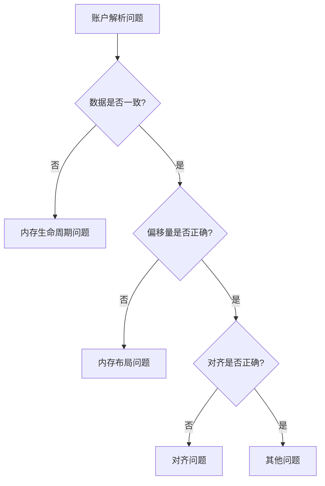

# Solana Zig SDK 账户解析问题排查指南

## 问题识别清单

当遇到账户解析相关问题时，按以下顺序排查：

### 1. 症状分类

#### 症状A：账户字段值不正确
- [ ] Owner 字段显示错误的 Pubkey
- [ ] Lamports 显示异常值
- [ ] Data 内容不匹配
- [ ] 标志位（is_signer, is_writable）错误

#### 症状B：程序崩溃或异常
- [ ] Stack overflow 错误
- [ ] Segmentation fault
- [ ] 未定义行为
- [ ] 数据在不同时刻显示不同值

#### 症状C：验证失败
- [ ] "Account not owned by this program"
- [ ] "Missing required signature"
- [ ] "Account data too small"
- [ ] "Invalid instruction data"

### 2. 快速诊断流程



## 常见问题及解决方案

### 问题1：栈内存生命周期错误

**诊断方法**：
```zig
// 添加调试代码验证
msg.msgf("Parse时: {x}", .{value_at_parse});
msg.msgf("使用时: {x}", .{value_at_use});
// 如果值不同，说明内存被破坏
```

**错误示例**：
```zig
pub fn parseInput(input: [*]const u8) struct {...} {
    var buffer: [100]u8 = undefined; // ❌ 局部变量
    return .{ .data = buffer[0..] }; // ❌ 返回局部变量指针
}
```

**正确做法**：
```zig
pub fn parseInput(input: [*]const u8, buffer: *[100]u8) struct {...} {
    // 使用外部提供的 buffer
    return .{ .data = buffer[0..] }; // ✅ 返回有效指针
}
```

### 问题2：账户数据布局错误

**Solana 账户内存布局**：
```
[1字节] duplicate_marker
[1字节] is_signer
[1字节] is_writable
[1字节] is_executable
[4字节] padding (original_data_len)
[32字节] key
[32字节] owner
[8字节] lamports
[8字节] data_len
[N字节] data
[10240字节] padding (MAX_PERMITTED_DATA_INCREASE)
[8字节] rent_epoch
[0-7字节] 对齐填充
```

**常见错误**：
- 忘记 10KB 填充
- 重复账户用8字节而非7字节填充
- 未处理8字节对齐

### 问题3：未对齐内存访问

**诊断**：
```zig
// 检查地址对齐
const addr = @intFromPtr(ptr);
if (addr & 7 != 0) {
    // 未对齐到8字节
}
```

**解决方案**：
```zig
// 方法1：使用 align(1) 指针
const pubkey = @as(*align(1) const Pubkey, @ptrCast(input + offset));

// 方法2：使用 readInt
const value = std.mem.readInt(u64, input[offset..][0..8], .little);
```

### 问题4：栈大小超限

**Solana 限制**：栈大小 4KB

**解决方案**：
```zig
// 减少栈使用
pub const MAX_ACCOUNTS = 16; // 从 64 减少到 16

// 避免大型栈数组
// ❌ var big_array: [1024]u8 = undefined;
// ✅ 使用账户数据作为临时存储
```

## 调试工具和技巧

### 1. 内存追踪宏

```zig
fn debugMem(comptime label: []const u8, ptr: anytype, len: usize) void {
    const addr = @intFromPtr(ptr);
    const first_8 = if (len >= 8) std.mem.readInt(u64, ptr[0..8], .little) else 0;
    msg.msgf("{s}: addr={x}, first_8=0x{x:0>16}", .{label, addr, first_8});
}
```

### 2. 偏移量验证

```zig
fn validateOffset(comptime expected: usize, actual: usize) void {
    if (actual != expected) {
        msg.msgf("OFFSET ERROR: expected {}, got {}", .{expected, actual});
    }
}
```

### 3. 账户完整性检查

```zig
fn verifyAccount(account: *const AccountInfo, expected_owner: *const Pubkey) bool {
    // 检查魔数
    if (account.data_ptr.duplicate_index != 0xFF) {
        msg.msg("WARN: Unexpected duplicate marker");
    }

    // 验证 owner
    if (!account.owner().equals(expected_owner)) {
        msg.msgf("Owner mismatch: {} vs {}", .{account.owner(), expected_owner});
        return false;
    }

    return true;
}
```

## 调试步骤模板

1. **收集信息**
   ```bash
   # 运行测试并收集日志
   node test.js 2>&1 | tee debug.log

   # 查找错误模式
   grep "Error\|Failed" debug.log
   ```

2. **添加调试点**
   ```zig
   // 在关键位置添加
   msg.msgf("CHECKPOINT 1: offset={}, data={x}", .{offset, data});
   ```

3. **二分查找**
   - 注释掉一半代码
   - 确定问题在哪一半
   - 重复直到找到问题行

4. **对比参考实现**
   ```bash
   # 查看 Rust 实现
   cat solana-sdk-rust/program-entrypoint/src/lib.rs
   ```

## 预防措施

### 代码审查检查点

- [ ] 所有返回 slice 的函数是否安全？
- [ ] 内存分配在正确的作用域？
- [ ] 对齐要求是否满足？
- [ ] 是否遵循 Solana 内存布局？
- [ ] 栈使用是否在限制内？

### 单元测试模板

```zig
test "account parsing" {
    var accounts_buf: [16]AccountInfo = undefined;
    var account_data_buf: [16]AccountData = undefined;

    // 构造测试输入
    var input = [_]u8{0} ** 1024;
    // ... 填充测试数据 ...

    const parsed = parseInput(&input, &accounts_buf, &account_data_buf);

    // 验证
    try testing.expectEqual(expected_owner, parsed.accounts[0].owner().*);
}
```

## 相关资源

- [Solana Program Runtime](https://docs.solana.com/developing/on-chain-programs/overview)
- [Zig Language Reference](https://ziglang.org/documentation/master/)
- [BPF/SBF 内存模型](https://github.com/solana-labs/rbpf)

## 问题上报

如果遇到本指南未涵盖的问题：

1. 收集完整的错误日志
2. 提供最小可复现示例
3. 记录环境信息（Solana 版本、Zig 版本）
4. 在项目 Issue 中报告